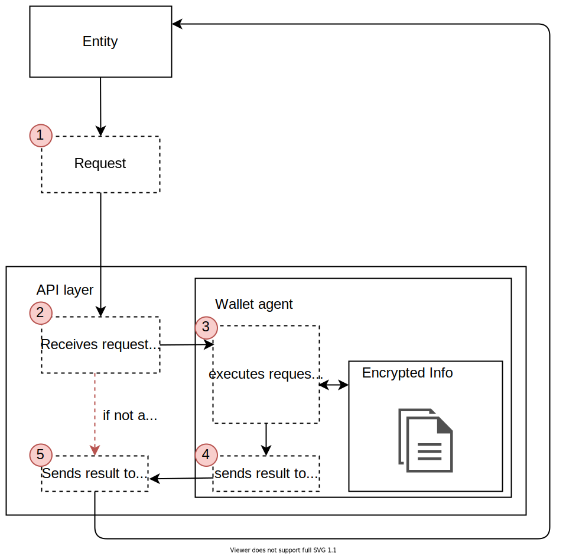
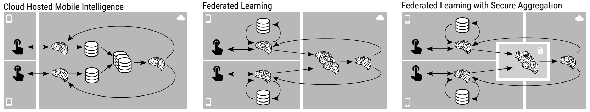
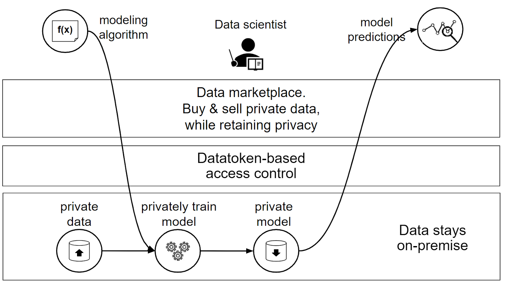
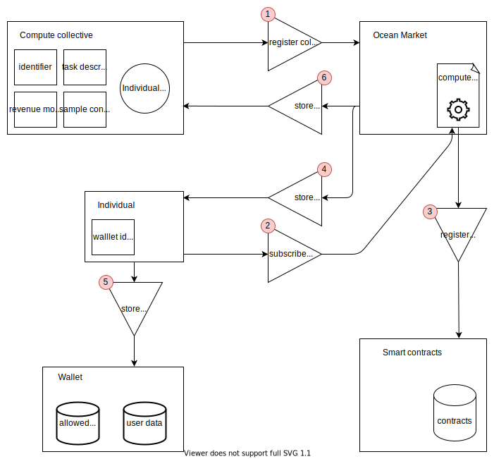
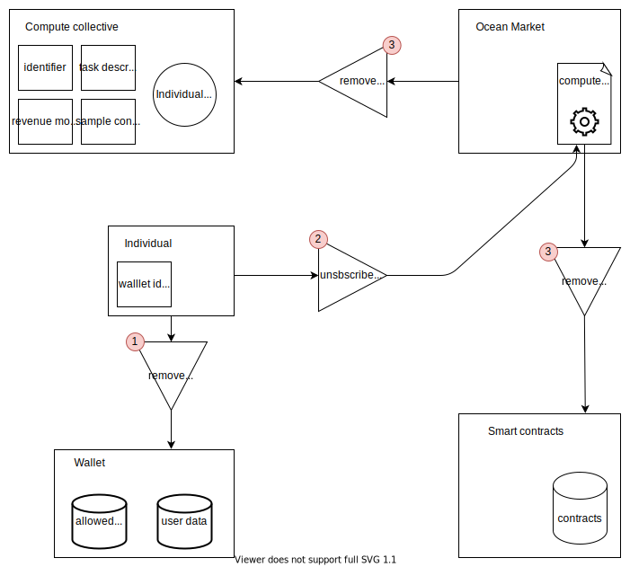

# compute-to-ssi

## Purpose
While personal data being protected and governed with SSI wallets can guarantee privacy of that data, currently A.I. algorithms are not able to learn from it. This is a large barrier for adoption. The purpose of this project is to use Compute-To-Data algorithms on data enclosed in personal Self-Sovereign Identity (SSI) wallets without compromising privacy.

## Definition

Extending *[Compute-to-Data](https://oceanprotocol.com/technology/Compute-to-Data)* from datasets to the data enclosed in personal *Self-Sovereign Identity* (SSI) wallets, ***Compute-to-SSI*** allows Data Consumers (e.g. data scientists) to learn from personal data, without compromising privacy.

### Actors

Compute-to-SSI introduces a new actor to the Ocean Protocol ecosystem — the ***individual***.

Individuals possess personal data enclosed in their SSI wallets, which Data Consumers might want to learn from.

To this end, individuals may choose to trust a specific Compute Collective to (selectively) access the data enclosed in their SSI wallet (i.e. subscribe to).

While individuals are a specific (individualized) instance of a *Data Provider,* strictly speaking, we have found it helpful to semantically separate the two in this Knowledge Base.

A Compute Collective can be seen as a new type of Compute Provider. Now instead of allowing algorithms to train on the data that is on the server of the Compute Provider, the Compute Collective has a list of subscribed individuals to which it can bring and run an algorithm.

### Asset Types

Compute-to-SSI introduces a new asset type to the Ocean Protocol ecosystem — the ***wallet***.

Wallets are — in principle — nothing more than encrypted data stores. What we refer to here as *wallets*, however, includes both this encrypted data store, as well as an agent that is able to decrypt, verify and share data enclosed in the wallet, as is the case with SSI wallets.

While, analogous to the newly introduced actor *individual*, wallets are a specific (individualized) instance of a *Dataset*, we have found it helpful to semantically separate the two in this Knowledge Base.

## Background

### **SSI** **Wallet**

A wallet is in principle an encrypted storage of data. In the context of SSI’s, a wallet is an encrypted storage of personal data. There is however more to an SSI wallet then only the data. When necessary, the wallet needs to be able to decrypt, verify and share information. For that, as part of the wallet, a wallet agent is used. This agent can access the encrypted information enclosed in the wallet. To be able to communicate with a wallet, an API layer is built around it. Other entities can now make requests to the wallet. Schematically, when a request is made to a wallet, it looks as follows:



SSI wallet simplified request flow

1. An entity sends a request to a wallet, i.e.: tell me the skill set of this person.
2. The API of the wallet verifies the request. If the request is allowed it moves to step 3, otherwise to step 5.
3. The wallet agent now executes the request and decrypts the necessary information.
4. This info is sent back to the API
5. The API sends the info (or not allowed error) back to the requester.

### **Federated Learning & Privacy-preserving AI**

"*Initially proposed in 2015, federated learning is an algorithmic solution that enables the training of ML models by* ***sending copies of a model to the place where data resides  and performing training at the edge**, thereby eliminating the necessity to move large amounts of data to a central server for training purposes.*

*The data remains at its source devices, a.k.a. the clients, which receive a copy of the global model from the central server. This copy of the global model is trained locally with  the data of each device. The model weights are updated via local training, and then the local copy is  sent back to the central server. Once the server receives the updated model, it proceeds to aggregate the updates, improving the global model without revealing any of the private data on which it was trained*" ([source](https://blog.openmined.org/what-is-federated-learning/))

Federated Learning is GDPR compliant.

**Federated averaging algorithm**

([source](https://arxiv.org/abs/1602.05629))

Google AI developed the federated averaging algorithm to overcome the main problem of low upload speeds on mobile devices, as well as non-IID data. In every iteration a (random) group of users is selected. That group each calculates the average gradient on its local data, using SGD. This means that multiple data points on which the algorithm can be trained are present at one user device, which might be used in one or multiple training passes to calculate the average gradient. Then only this average gradient needs to be sent to the central model, and the model performs a weight update based on the average value of the average gradient of all users.

**Secure aggregation protocol**

([source](https://eprint.iacr.org/2017/281))

A protocol that lets a central server / model only decrypt aggregated updates so that no individual user data can be inferred from received updates. Although the theoretical basis is present, this protocol is currently still being developed by Google. This protocol can obviously work very well with the previously explained federated averaging algorithm.

Federated learning cannot yet solve all machine learning problems, specifically when there is a need for labeled data (e.g. a dog breed classification task) ([source](https://ai.googleblog.com/2017/04/federated-learning-collaborative.html)).



LEFT: in cloud hosted intelligence (the traditional Machine Learning approach) users send their data to the central server. Multiple user data is stored together and used to train a model. MIDDLE In federated learning the model is sent to the user and is locally trained on that data. Updates for the model are sent to the central server. RIGHT: in the federated learning with secure aggregation approach the model is sent to the user and is again locally trained on that data. Updates are sent to a virtual incorruptible third party (we could implement this in the architecture), that collects multiple updates and aggregates them. Only an average update step over multiple user updates is sent to the model so that no individual user data can be inferred from that.

### Ocean Protocol

([source](https://oceanprotocol.com/tech-whitepaper.pdf))

**Datatokens**

In Ocean Protocol, when a new dataset gets published, it receives its own *datatoken* by means of Ocean’s smart contracts and libraries.

Datatokens are ERC20 tokens, which provide *access* to the respective dataset. That is: if and when you hold 1.0 datatokens of the corresponding dataset, you can access it. To access the dataset, you send 1.0 datatokens to the Data Provider. As such, while access to the dataset can be transferred to others (by transferring 1.0 datatokens), these datatokens cannot be “double-spent”.

In short: “Datatokens are ERC20 tokens to access [datasets]. Each [dataset] gets its own datatoken.”

**Marketplaces**

*Marketplaces* are decentralized apps (dApps) that facilitate the whole data flow (i.e. publish data, set price, curate data, discover data, buy data, and consume data).

As such, through marketplaces, *Data Consumers* can buy datatokens of corresponding datasets in order to gain access to these datasets. In order to actually access to the dataset (i.e. consume data), they send 1.0 datatokens to the *Data Provider*.

**Compute-to-Data**

With *Compute-to-Data,* Data Providers can share and monetize their data while preserving privacy. Conceptually, this looks as follows:



Conceptual visualization of Ocean Compute-to-Data.

Compute-to-Data introduces a new way to access data, in which the data is not accessed directly (i.e. downloaded) by the Data Consumer, but instead indirectly, by allowing algorithms to run on private data within the premises of the Data Provider.

For this, the Data Provider needs to set-up a compute environment in the form of a Kubernetes cluster, where pre-approved containerized algorithms can run and learn from the private data.

Compute-to-Data datasets are published, discovered and traded exactly the same as direct-download datasets. That is to say: when you publish a Compute-to-Data dataset, it receives its own datatoken, which can be traded through marketplaces.

## Architecture

In this section an architecture will be proposed to allow for Compute-to-SSI functionality. Several components will be described that should be included in this architecture and implemented on the Ocean Protocol.

### Federated Learning on SSI’s with Secure Aggregation in Ocean

As said before, federated learning is an algorithmic approach that sends copies of machine learning models to the place where data is stored, and then trains the model at the edge. We think the model should contain an aggregated learning protocol so that no model can ever infer private info from single weight update steps. The diagram below together with its description will give an overview of the architecture. In the upcoming sections after the different components will be described in more detail.


**Description:**

1. A Data Consumer wants to use an algorithm. This can be an algorithm that he made himself. Algorithms might need a new structure as opposed to how they work now in Ocean. The Data Consumer can, through the marketplace, select the algorithm and Compute Collective that it wants to use. Note that Data Consumer, Compute Collective and maker of the algorithm can all be the same entity.
2. The marketplace lets a Compute Collective start computing. The Compute Collective has a list of wallet ids that it is allowed to use. This is because he has previously gained access to either all or a subset of wallets depending on whether users described to the Compute Collective.
3. The Compute Collective sends all wallet ids and the algorithm to the distributor.
4. The Ocean Distributor has access to wallet locations and sends the algorithm to the specific wallets.
5. The wallets use the algorithm to compute a gradient based on the data that is stored in the wallet. Preferably, it does so many times to further secure data privacy.
6. The wallets all send their gradients to the aggregator, which collects the gradients of the whole batch, and averages it. In this way no single individuals data can be inferred.
7. The average gradient is sent to the Compute Collective again so that it can perform a model update.
8. steps 3 to 7 can be repeated as many times as needed. After the training is done the resulting model is sent back to the Data Consumer.

The secure aggregation protocol can be entirely managed by Ocean, no Ocean Data Consumer will ever have access to the aggregation environments. Therefore, once the average gradient reaches the central model, no individual data is inferable from it.

### Compute on SSI wallets

In this section we describe a schematic simplified task of how computations like training a network (or other machine learning tasks) might work inside a SSI wallet.

To our knowledge, computations like training a network on local data inside a wallet have not been carried out before. It is however widely known that the agent in a wallet needs to be able to provide zero-knowledge proofs and should therefore be able to carry out some form of computation. Therefore, we are confident that an existing SSI wallet can be extended, or a new SSI wallet can be built so that computations in the form of training a network inside the wallet can be made possible.

Looking at the previously shown figure describing the simplified request flow of a wallet (section Background: SSI wallet), we can describe a process of training a network on an SSI wallet:

1. An entity sends a request to a wallet, together with a model, and a script to carry out one or multiple training steps of that model on data that is stored in the wallet.
2. The API verifies the credentials of the Compute Collective.
3. The wallet agent retrieves the necessary data from the encrypted storage, and carries out the task of training a model.
4. Now that the model is trained, an (average) gradient of the model parameters will be inferred. How this needs to be done should be specified in the task description.
5. The API sends the (average) gradient of the model parameters back to the requester.

The interaction between the Ocean Distributor and the individual (or rather: their wallet) is summarized conceptually in the pseudocode below:

```python
function to distribute an algorithm to a wallet:
    if the distributor has access to the wallet:
        if the wallet contains the required data for the algorithm to run:
            the algorithm executes on the data enclosed in the wallet and produces an output
            
            the output of the algorithm execution is sent to the aggregator -> success

						the access fee is paid to the wallet
        else:
            the wallet does not contain the data required for the algorithm to run -> abort
    else:
        the distributor does not have access to the wallet -> abort
```

The exact workings of the interaction between the Ocean Distributor and an individuals SSI wallet is described in more detail later.

To ensure security and privacy the task description and the model should be provided in some virtual environment so that no external connections can be made and no private data can be exposed. It is important to think about algorithmic standards that need to be met in order to be sure that no Compute Collective can ever write an algorithm that exposes private data.

### Compute Collective

*a Compute Collective will be a new component to Ocean*

As can be seen from the architecture diagram, a Compute Collective needs a list of individuals or wallet ids that allow the Compute Collective to compute on their wallet. Before the Compute Collective can gather access to wallets, a few things are required:

- A key with which the task of the collective can be identified.
- Task description: in the task description a general overview will be given of what your data will be used for. In the simplest case one or multiple pre-defined specific algorithms are allowed by a Compute Collective which should be described in the task description. A Compute Collective can also choose to allow a range of algorithms that meet specific requirements (e.g. algorithms with a *medical purposes)*. This means that if subscribed to a Compute Collective that has specified requirements for algorithms as a task description, at any point in time an algorithm that meets those requirements can be added and can be trained on the wallets of individuals subscribed to the collective.
- Revenue model: the compensation scheme that is used by the Compute Collective to pay individuals, this would probably boil down to an access rate. Individuals are compensated in Ocean tokens for granting access rights to the Compute Collective at the moment the Ocean Distributor tries to distribute the algorithm to their wallet.
- The transactions should all be fully automatic. Therefore, following (directly or indirectly) from the Revenue model, an example smart contract should be made which individuals can sign when they want to subscribe to a Compute Collective.

When at least these four elements are specified, the Compute Collective becomes operational in Ocean Marketplace. Individuals can now subscribe to a Compute Collective, giving the collective some form of identifier, so that the Compute Collective knows that it can visit the wallet of that individual. At the same time the individual receives a key with which it can identify the task of the Compute Collective whenever it comes to visit the wallet. This key must therefore be stored in the wallet and the wallet needs a verification method to also deny permission to a Compute Collective to which it has not subscribed.

The flow of registration of a Compute Collective, and the registration of individuals to it is captured in the following diagram:



1. Provided that the four aforementioned necessary elements are present, a Compute Collective should be able to register itself to the Ocean market.
2. An individual can now subscribe to a Compute Collective, it signs the example contract, perhaps fills out necessary information and submits its identifier (some identifier so that the Compute Collective knows that it can access that individuals wallet, and where it can access that individuals wallet) to the Compute Collective. 
3. The just signed smart contract is registered.
4. The individual receives the identifying key of the collective.
5. This key is stored in the individuals wallet so that the wallet agent can later on validate any Compute Collective that wants to run an algorithm on the wallet.
6. The individuals identifier is stored in the Compute Collective.

**Termination of a contract**

As with any type of information stored in SSI wallets the individual behind the wallet needs to be able to revoke information at any time. The permission key stored in the wallet of the individual should therefore at any time be deletable and from that exact moment, the Compute Collective should not be able to access the wallet anymore. The flow of retracting a contract is described in the following diagram.



1. An identifying key of a collective can at any time be removed from the wallet by the individual. From this point on the Compute Collective will not have access to the wallet anymore and no algorithm can be run on the wallet by it.
2. Then through the Ocean Market, the individual can unsubscribe itself from a compute collective. 
3. The individuals identifier is removed from the individuals group of the Compute Collective and the smart contract is removed.

**Challenges:**

In the case of a Compute Collective allowing multiple algorithms by only specifying certain requirements or properties that algorithms should have, we need to think about what these requirements and properties should look like. A procedure of how we are going to check if algorithms meet those requirements so that no *unwanted* algorithm is by mistake granted access to an individuals wallet is needed. Perhaps on top of having a very strict requirements scheme, an algorithm needs to registered for a couple of days to a Compute Collective, after which all individuals subscribed to the Compute Collective will be notified about the new algorithm and have some time to opt-out.

### Ocean Distributor

*an Ocean Distributor will be a new component to Ocean*

To ensure security, the exact wallets of individuals that are accessed by the task are not known to either the central part of the algorithm nor the Compute Collective. At the start of training a model through a federated algorithm, the Compute Collective merely supplies a list of individual id’s to which it should have permissions to access, and the algorithm. The Ocean distributor, which is a secure Ocean component, will entirely on its own handle the distributing of the algorithm. The distributor can randomly select a subset of individuals per iteration to which it wants to distribute the algorithm. 

### Ocean Aggregator

*an Ocean Aggregator will be a new component to Ocean*

Gradient updates, even when averaged over multiple training runs, can yield some implicit information about an individual when trained only on data of that individual([Bonawitz et al.](https://eprint.iacr.org/2017/281.pdf) (2017)). The gradients do not expose direct individual information. To however tackle the problem of individual information being inferable by some (malicious) part of an algorithm, a secure aggregator provided by Ocean will average gradients over multiple individuals.

The central part of the algorithm receives only the average gradients over a group of users and would in theory now only be able to infer information about the group of individuals. Never will the algorithm be able to infer information about one individual.

To illustrate this with an example: in a federated learning task of text prediction based on user keyboard input, information like frequently used words by a user might be inferred based on a single users gradients. If we are to aggregate gradients of a thousand users, only information like frequently used words by that group of people might be inferable.

In most current SSI wallets information is requested by an entity, but also sent to that same entity by the wallet (if permitted). In our architecture, the aggregator and distributor are two separate components, but in practice they could be the same component to tackle this problem.

### A training iteration in more detail

We have seen now what the overall structure of the architecture is, and we have discovered a possible subscription process to a Compute Collective, by which a contract is made. We have however not discovered how the user is actually paid. For that we first need to describe a sample contract. 

**Smart contracts**

The sample contract of a Compute Collective defines the conditions under which the Compute Collective is obligated to pay (and therefore automatically does pay) the individual. The Compute Collective wants to make sure that it only pays the user when the data it needs is present at the individual's wallet. For this, as part of the task description, the Compute Collective should specify exactly which data fields are needed. From there it is the responsibility of the user to make sure that the data is present in the wallet.

The individual wants to make sure that, once its wallet is accessed, he gets paid.

In pseudo-code a sample contract could look like the following (the placeholder RATE needs to be filled in according to the access pay rate of the Collective):

```python
if Collective has access to wallet
	if necessary data is present in wallet
		an amount of [RATE] is transferred from Collective to individuals SSI wallet
```

Note that in this contract the responsibility of writing a proper non-error producing algorithm lies with the Compute Collective. When the Compute Collective has accessed a wallet and the presence of the correct data is verified (perhaps via zero-knowledge proofs) the individual should get paid, even if the algorithm by mistake produces an error while executing on the wallet. 

**Challenge**

A challenge to this is that a strict form for the required data needs to be specified. The name of data fields together with its type (i.e. int, string, etc...) should be given by the Compute Collective. When this is done, a data verifier can check the existence of this data through perhaps zero-knowledge proofs.

Now that the broad idea of the smart contracts is explained we can dive a little deeper in the flow of executing an algorithm on an individuals wallet. Consider the following diagram:


This diagram describes steps 3 to 5 of the general architecture diagram in more detail, and includes necessary steps for the payment method.

1. The Compute Collective dispatches its algorithm, together with the individual's identifiers to an Ocean Distributor. 
2. The Ocean distributor knows how to reach SSI wallets by the identifiers supplied to it. It selects a random subset of the individuals and makes a request of executing the algorithm.
3. The wallet first checks if any of the Compute Collective keys that it has stored matches the Compute Collective that is trying to reach it now.
4. If allowed, the wallet executes the algorithm. This includes of course first the Data Requirements check.
5. The outputs (often: gradients) are sent to the Ocean Aggregator. 
6. Next to the previously describe task of the Ocean Aggregator to just aggregate the data, the aggregator also acts as a sort of verifier. When the gradients reach the aggregator, the aggregator notifies the smart contracts. 
7. Whenever all conditions of the contract are met, the smart contract will make sure that the transaction specified in the contract takes place.
8. Now the individual receives payment. Note that in this figure the wallet that stores the payment is the same as the SSI wallet that is used to store the individual's data, but in theory these can be different wallets, as long as they are correctly specified in the smart contract.

### Challenges:

- When we use pay per access every individual gets paid at the moment that an algorithm reaches its wallet. Every transaction in crypto is logged and therefore detectable. In theory, if the Compute Collective only does one iteration over 1000 people (some minimum number should be required) and then stops, the consumer of the algorithm would be able to trace back the individuals that are used for training so that it could make inferences about this subset of people based on the gradients that it received. This might be something that we can accept, but then subsets of whole groups should always be sufficiently large. Also what we still need to find out is if transactions are actually traceable to an individual
- Not all algorithms and machine learning models lend themselves for a privacy preserving federated learning approach. Some existing models might need tweaks to work in an iterative, privacy preserving way, while other models may not be suitable at all. We know however that neural networks are suitable for privacy preserving federated learning tasks.
An approach to checking if an algorithm will not violate any privacy constraints should be developed. This can either be a framework in which algorithms need to be constructed that does not allow for privacy violations to be implemented, or an automatic system to test an algorithm for privacy violations. Possibly a combination of the two would be best.

### Encrypted communication

Communication between all different types of components should be encrypted. Especially communication between wallets and aggregator should be secure! When implementing the proposed architecture one needs to think carefully about the encryption methods that will be used.

## Some future ideas

We have a few ideas with which the proposed architecture can possibly be extended in the future.

- A new revenue model, pay for model: Compute Collectives and individuals might team up to train a model. Once the trained model is bought the Compute Collective and individuals get paid.
- We know of the existence of decentralized neural networks. In short decentralized neural networks are neural networks that are split up into multiple parts. If we were to split up a network in two parts, the start of the network would be part of the algorithm sent out to the individuals SSI wallet, and the second part would be a central compute part. The SSI wallet runs its data through the first part of the network. The result is then sent to the central part of the network and the result based on that partial network is calculated. This result is sent back to the SSI wallet again, which calculates a loss, error or some sort of objective function. This is then again sent back to the central part of the network. Now backpropagation starts moving backwards through the layers eventually reaching the layers in the SSI wallet again. Once this is all done the decentralized part of the network can move onto the next SSI wallet and this process starts over. 
The problem with this is that projected user data over the first layers of the network would reach the central part of a consumer specified algorithm. Just as with single user gradients, information can be inferred from this. 
A way to tackle this would be homomorphic encryption, which theoretically allows you to perform computations on encrypted data. Computations on homomorphically encrypted data are however still very slow and/or not all computations are possible.
- As computation is now done on the wallets of individuals, it might become easier to tamper the system. More specifically, an individual might, for some spiteful reason, want to receive payment without supplying useful feedback to the model. The individual might design its own SSI-wallet, where the wallet agent will accept the model, but applies gradient tampering. This could mean that the wallet agent intercepts the gradients from the model before sending them to the aggregator. The gradients are then tampered or even set to completely random values. The model will now not be able to learn from these gradients. With some carefull construction of tampered gradients the model might even unlearn previously learned concepts. We do not think that gradient tampering will occur often, but because it is a possibility we think that in the future we should take care of this phenomenon. The Ocean Aggregator component could be extended with a gradient anomaly detector. In this way, gradients that differ a lot from the others will automatically be neglected. As an additional benefit this also takes care of outliers not being taken into account.

## Example use case

In this section an example use case of the federated learning system will be described. With this we hope to give a clear overview of the possibilities of federated learning. We will consider a case where a consumer has a training objective to predict necessary skills, preferences and/or characteristics of potential employees for a specific job. The consumer will in this example set up his own compute collective to gather access to multiple SSI wallets.

### Training Objective

The consumer wants to be able to make predictions about job performance of individuals based on skills, characteristics & preferences. The performance of an individual is captured by some pre-defined weighted average of quantified peer-reviews of colleagues, manager evaluations, sales numbers etc. Every skill of an individual, for instance programming, is a (weighted) average over one or multiple measurements belonging to that skill. A measurement can for instance be an assessment score or a grade received during college for a specific programming course. Thus, the consumer wants to be able to predict the required skills, characteristics & preferences for the optimal job or task performance, which in their turn capture several measurements by taking a weighted average.

### Data Requirements

The consumer needs to specify data requirements, so that an individual knows which data should be stored in its wallet if the individual wants to take part in the Compute Collective. In this example, the data requirements will be listed in terms of a minimum number of skills, characteristics, preferences, peer reviews and manager evaluations. In this example we choose arbitrarily that the consumer specifies an individual should have at least present in its wallet:

- 1 job title of the current job
- 5 or more skills, all with at least one measurement
- 5 preferences
- 5 characteristics
- 1 manager evaluation
- 1 peer review

Of course, an individual is always allowed to list more skills, preferences, characteristics, manager evaluations or peer reviews. If multiple manager reviews are present the algorithm could perform multiple training iterations on a single wallet.

To maintain the necessary level of data consensus across all individuals, the consumer needs to specify all possibilities for skills, preferences, characteristics and job titles. Individuals can then choose values from the list of possibilities to store in their wallets. The exact list of possibilities is for now left to the imagination of the reader. The exact form of the manager evaluation and peer review are for this example chosen to be integer grades between 0 and 10.

**Challenge**

In this case a very wide range of possibilities for skills, preferences and characteristics exists. In order for personal data like this to be usable by a machine learning algorithm that used federated learning, storing data in an exactly predefined form that the algorithm will know is very important. If Individuals were to store the required data manually in their wallets mistakes are easily made. 

To perhaps solve this issue, a consumer could provide a data creation tool that locally, outside of any web server, lets the individual create the data. In this example that would mean that individuals would be able to select skills, preferences and characteristics from a list and specify manager evaluations and peer reviews in a way such that the form (which should be an integer number between 0 and 10) is validated. The outcome from this tool could then be stored by the individual in his SSI wallet.

### Algorithm

The consumer should also implement the algorithm that it will be using. This example task could for instance use a simple feed-forward neural network with only a few layers. The input of the network would then be a job title and an integer grade from a manager and a peer combined. The output of the network are the skills, preferences and characteristics.

**Idea**

We might want to use an extreme learning machine for this task instead of a *traditional* feed-forward neural network to reduce computation times. In short, an extreme learning machine is a feed-forward layered neural network where only the weights of the last hidden layer to the output layer are trainable. The rest of the weights is randomly initialized and stays fixed during the training process. Extreme learning machines have proven to greatly speed up training processes while being able to produce a good generalization performance ([source](https://www.sciencedirect.com/science/article/abs/pii/S0925231206000385?via%3Dihub)). 

### Task definition

The task definition that the consumer needs to describe goes hand in hand with the algorithm. The task definition allows to carefully define how the network will be trained exactly. In this case we would need to specify how different measurements are combined to create certain skills and how we would normalize input data of skills, preferences and characteristics. Characteristics and preferences would be converted into a binary value, signalling a preference/characteristic, and the skills would be turned into a continuous normalized value between 0 and 1. In this way skills, preferences and characteristics can in principle have the same influence on the performance measure.

### Compute Collective

Now that a consumer has stated all necessary concepts for its algorithm, it needs to gather access to wallets by letting users subscribe to the compute collective in Ocean market. The consumer specifies a rate of 0.005 Ocean per wallet access. An example smart contract is automatically induced from this rate and the data requirements. The Compute Collective is now registered to the Ocean market.

### Subscription period

The subscription period starts now. The consumer needs to wait for enough individuals to subscribe to its Compute Collective. There is some minimum required individual subscriptions specified by ocean that is needed to ensure privacy. It is however more likely that the Compute Collective, in this case, needs even more individuals in order for the algorithm to be properly trained without overfitting.

### Start of the training process

Once the  Compute Collective has collected enough individuals, it specifies a maximum budget that can be spent on training. In this case we arbitrarily choose 10,000 Ocean. This means that in total 10,000 / 0.005 = 2,000,000 wallet accesses can be done during the training process. If e.g. 100,000 individuals have subscribed to the compute collective, it means that on average every wallet within the individual group of the Compute Collective is visited 20 times. 

The algorithm is then distributed to individuals wallets. In the wallet, the necessary data is gathered and the inputs to the network are normalized. The algorithm is run, the loss is calculated from which the gradients are computed. The gradients are sent to Oceans Aggregator.

### Aggregation

Gradient updates resulting from a training step on an individuals wallet are sent to the ocean aggregator. Upon receiving gradients from a wallet, the aggregator sends verification to the smart contract between the Compute Collective and the individual, so that transactions are triggered. 

Per batch of a pre-defined size, the aggregator averages the gradients and sends them to the central part of the neural network within the Compute Collective.

### Model update

The network is now updated with the aggregated gradients. The process starts over by distributing the (updated) network again.

### Training process completed

The consumer can at all times retrieve its intermediate model with the updated average gradients. If the consumer decides that the models' performance is good enough, it can stop the training process. Also when the budget of 1000 Ocean is spent the training process automatically stops.

Individuals are already paid with the use of smart contracts. The consumer now has a trained algorithm, while the privacy of individuals is preserved and data of the individuals has not left their SSI wallets.
